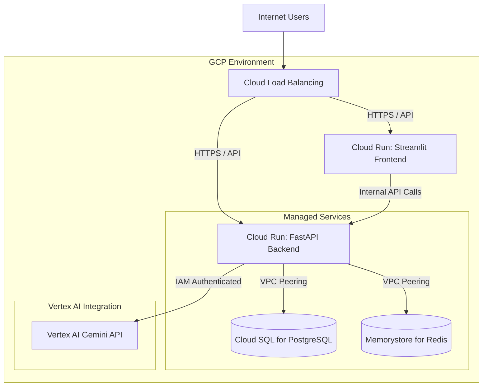

# GCP Deployment Guide: Enterprise Multi-Agent Analytics Assistant

This guide outlines the optimal architecture for deploying the Enterprise Multi-Agent Analytics Assistant on Google Cloud Platform (GCP) and exposes it via a public API. It also covers how to securely integrate Google's internal Gemini models via Vertex AI.

---

## 1. Optimal GCP Architecture

For a scalable, secure, and production-ready enterprise deployment, the following GCP services are recommended:

### Architecture Diagram (Cloud-Native)



### Component Breakdown

1. **Cloud Run (Compute)**: 
   - Deploy both the FastAPI Backend and Streamlit Frontend as separate Cloud Run services. Cloud Run automatically scales based on traffic (scale-to-zero available to save costs) and provides a public HTTPS endpoint natively.
2. **Cloud SQL for PostgreSQL (Database)**: 
   - Replaces the local Docker Postgres instance. Provides high availability, automated backups, and secure VPC peering to the backend.
3. **Memorystore for Redis (Cache)**:
   - Replaces the local Docker Redis instance for managing conversational memory states securely and persistently across multiple Cloud Run instances.
4. **Cloud Load Balancing (Optional but Recommended)**:
   - If you want a custom domain, WAF (Web Application Firewall), and global routing, place an HTTP(S) Load Balancer in front of your Cloud Run services.

---

## 2. Integrating GCP's Internal Gemini (Vertex AI)

Instead of using consumer API keys (`AIzaSy...`), enterprise deployments should use **Vertex AI**. Vertex AI provides enterprise-grade data privacy (Google does not train on your data) and relies on GCP Identity and Access Management (IAM) for authentication—no hardcoded API keys needed.

### Step 2.1: Update Python Dependencies

You need the Vertex AI LangChain package. Add this to your `requirements.txt`:

```text
langchain-google-vertexai
```

### Step 2.2: Code Changes (`app/agents/base.py`)

Update the LLM initialization to use Vertex AI instead of standard GenAI.

**Current (API Key based):**
```python
from langchain_google_genai import ChatGoogleGenerativeAI

def get_llm():
    return ChatGoogleGenerativeAI(
        model=settings.LLM_MODEL, 
        google_api_key=settings.GEMINI_API_KEY
    )
```

**New (Vertex AI based):**
```python
from langchain_google_vertexai import ChatVertexAI

def get_llm():
    # Authentication is handled automatically via GCP IAM service accounts
    return ChatVertexAI(
        model_name="gemini-1.5-flash-preview-0514", # Or gemini-1.5-pro
        location="us-central1", # e.g., us-central1
        project="your-gcp-project-id" # Optional if default credentials are set
    )
```

### Step 2.3: IAM Configuration
Ensure the Service Account attached to your Cloud Run Backend has the following role:
- `Vertex AI User` (`roles/aiplatform.user`)

---

## 3. Deployment Steps

### Step 3.1: Provision Managed Services
1. **Cloud SQL**: Create a PostgreSQL instance. Note the Connection Name.
2. **Memorystore**: Create a Redis instance in the same region. Note the internal IP address.
3. **VPC Network**: Ensure Serverless VPC Access is configured so Cloud Run can talk to Cloud SQL and Memorystore via private IPs.

### Step 3.2: Build and Push Docker Images
Authenticate and push your images to Google Artifact Registry (GAR).

```bash
# Set your GCP project
export PROJECT_ID="your-gcp-project-id"

# Configure Docker
gcloud auth configure-docker us-central1-docker.pkg.dev

# Build and Push Backend
docker build -t us-central1-docker.pkg.dev/$PROJECT_ID/repo/analytics-backend docker/Dockerfile.backend
docker push us-central1-docker.pkg.dev/$PROJECT_ID/repo/analytics-backend

# Build and Push Frontend
docker build -t us-central1-docker.pkg.dev/$PROJECT_ID/repo/analytics-frontend docker/Dockerfile.frontend
docker push us-central1-docker.pkg.dev/$PROJECT_ID/repo/analytics-frontend
```

### Step 3.3: Deploy to Cloud Run

**Deploy the Backend:**
```bash
gcloud run deploy analytics-backend \
  --image us-central1-docker.pkg.dev/$PROJECT_ID/repo/analytics-backend \
  --platform managed \
  --region us-central1 \
  --allow-unauthenticated \
  --vpc-egress all-traffic \
  --set-env-vars="LLM_PROVIDER=google,POSTGRES_HOST=<CloudSQL_IP>,POSTGRES_USER=postgres,POSTGRES_PASSWORD=<Secret>,REDIS_HOST=<Redis_IP>"
```

*Note: The backend will generate a public URL (e.g., `https://analytics-backend-xyz.a.run.app`). You will need this for the frontend.*

**Deploy the Frontend:**
```bash
gcloud run deploy analytics-frontend \
  --image us-central1-docker.pkg.dev/$PROJECT_ID/repo/analytics-frontend \
  --platform managed \
  --region us-central1 \
  --allow-unauthenticated \
  --set-env-vars="BACKEND_URL=https://analytics-backend-xyz.a.run.app"
```

## 4. Securing the Public API
If you expose the FastAPI backend over a public URL, you should secure the `/api/query` endpoints.
- **Option A**: Use API Keys via FastAPI dependencies (`fastapi.security.APIKeyHeader`).
- **Option B**: Use GCP API Gateway in front of Cloud Run to handle rate limiting and API key validation.
- **Option C**: Use Cloud Load Balancing with Cloud Armor to protect against DDoS attacks.
