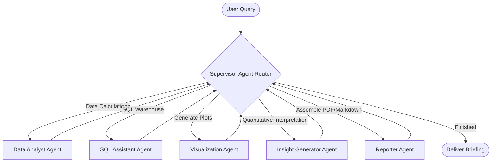

# Enterprise Multi-Agent Analytics Assistant

[](https://github.com/)
[](https://opensource.org/licenses/MIT)
[](https://github.com/langchain-ai/langgraph)
[](https://streamlit.io/)

A production-ready Multi-Agent Generative AI analytics assistant built with **LangGraph**, **LangChain**, and **FastAPI**, featuring a responsive **Streamlit** frontend. The platform implements a real-world enterprise AI workflow, allowing business users to ingest tabular datasets, query historical relational schemas, generate qualitative executive briefs, render interactive charts, and audit execution steps with built-in observability tracing.

---

## 🏢 Enterprise Problem Statement

In modern organizations, business operations data is siloed across static spreadsheets (CSV/Excel) and transactional databases (PostgreSQL/Databricks). Traditional Business Intelligence (BI) tools require SQL expertise, dashboard-building time, or manual report drafting to explain anomalies—such as a sudden revenue drop in Q3.

**The Solution:** The *Enterprise Multi-Agent Analytics Assistant* orchestrates a team of specialized, role-based AI agents. Business leaders ask questions in plain English, and the platform dynamically delegates tasks: querying tables, generating Plotly configurations, explaining operational anomalies, and exporting polished briefs.

---

## 🚀 Key Features

* **LangGraph Multi-Agent Orchestration**: Directs tasks across a structured, cyclical graph (Supervisor, Analyst, Visualizer, SQL, and Report engines) with state recovery.
* **Dual Data Paths**:
  * **Data Analyst Agent**: Evaluates uploaded CSV/Excel files using a secure, sandbox-style Pandas Python code execution module.
  * **SQL Assistant Agent**: Performs safe, read-only SQL SELECT queries against relational schemas.
* **Declarative Interactive Visualizations**: Generates Plotly chart specifications natively as JSON definitions, rendering clean, responsive graphs.
* **Persistent Conversational Memory**: Thread-grouped session memory managed via **Redis** with thread-safe **In-Memory dict fallbacks**.
* **Zero-Setup Database Fallback**: Automatically connects to PostgreSQL and Redis. If they are not running, it falls back seamlessly to **SQLite** (pre-seeded with operational data) and **In-Memory** cache layers.
* **Built-in Observability & Tracing**: Step-by-step visual execution logs detailing agent input parameters, outputs, status tags, and durations.

---

## 🛠️ Tech Stack

* **Orchestrator**: LangGraph, LangChain Core
* **Language Models**: Google Gemini (`gemini-2.5-flash`), OpenAI (`gpt-4o-mini`) — API key required
* **API Framework**: FastAPI, Uvicorn, Pydantic Settings
* **Databases**: PostgreSQL (seeded warehouse data), Redis (conversation store), SQLite (fallback)
* **Frontend**: Streamlit, Plotly.js
* **Deployment**: Docker, Docker Compose

---

## 📐 Architecture & Multi-Agent Workflows

Detailed Mermaid workflow and sequence diagrams can be reviewed in [docs/architecture_diagram.md](file:///c:/Users/dspsi/Desktop/new_projects/enterprise_multi_agent_analytics_assistant/docs/architecture_diagram.md).

### Multi-Agent Flow Overview



---

## 📦 Directory Structure

```
enterprise-multi-agent-analytics-assistant/
│
├── .env.example
├── docker-compose.yml
├── requirements.txt
├── README.md
│
├── app/
│   ├── main.py                 # FastAPI Entry Point
│   ├── config.py               # Pydantic Settings
│   ├── agents/                 # Specialized Agent Definitions (Supervisor, SQL, Data Analyst, Viz)
│   ├── workflows/              # LangGraph workflow graphs and global states
│   ├── tools/                  # Python sandboxing & SQL metadata lookups
│   ├── memory/                 # Postgres/SQLite and Redis/In-memory persistent layers
│   └── observability/          # Structured JSON logging & workflow tracing
│
├── frontend/                   # UI Layer
│   └── app.py                  # Streamlit Web App
│
├── docker/                     # Dockerfiles
│   ├── Dockerfile.backend
│   └── Dockerfile.frontend
│
├── docs/                       # Diagrams and documentation
│   └── architecture_diagram.md
│
├── examples/                   # Sample enterprise dataset
│   └── sales_and_marketing_q3.csv
│
└── tests/                      # Unit and integration tests
    ├── test_agents.py
    └── test_workflow.py
```

---

## ⚙️ Quick Start Installation

### Option 1: Running with Docker Compose (Recommended)
You do **not** need to install PostgreSQL or Redis locally; Docker Compose spins up all containers in isolation.

1. **Clone the Repository** and navigate to the directory:
   ```bash
   cd enterprise_multi_agent_analytics_assistant
   ```

2. **Configure Environment Variables**:
   Copy `.env.example` to `.env` and provide your Google Gemini API Key (required — the app will not function without it):
   ```bash
   copy .env.example .env
   ```
   Edit the `.env` file:
   ```env
   LLM_PROVIDER=google
   GEMINI_API_KEY=AIzaSy... # Your actual Gemini key
   CONVERSATION_HISTORY_LIMIT=20  # Max conversation turns retained per session
   ```

3. **Start Containers**:
   ```bash
   docker-compose up --build
   ```

4. **Access the Applications**:
   * **Streamlit UI**: `http://localhost:8501`
   * **FastAPI Docs**: `http://localhost:8000/docs`

---

### Option 2: Running Locally (Bare-Metal)
If Docker is not installed, the platform uses SQLite and In-Memory cache fallbacks automatically.

1. **Create and Activate Virtual Environment**:
   ```bash
   python -m venv venv
   # On Windows:
   venv\Scripts\activate
   ```

2. **Install Dependencies**:
   ```bash
   pip install -r requirements.txt
   ```

3. **Set Up Environments**:
   Ensure `.env` contains `LLM_PROVIDER=google` or `openai`, alongside your respective API keys. A valid Gemini or OpenAI API key is **required**. The app will not function without one. You can also enter your API key directly in the Streamlit sidebar at runtime.

4. **Start the FastAPI Backend**:
   ```bash
   uvicorn app.main:app --host 127.0.0.1 --port 8000 --reload
   ```

5. **Start the Streamlit Frontend** (in a separate terminal):
   ```bash
   streamlit run frontend/app.py
   ```

---

## 🔍 Example Prompts

Load the sample dataset located at `examples/sales_and_marketing_q3.csv` to run the following test flows:

* **Pandas Analytics & Charting**: 
  > "Compare region-wise revenue and costs"
* **Anomaly Identification**: 
  > "Why did sales revenue drop in Q3? Explain the metrics."
* **Relational SQL Database Inquiries**:
  > "Select the total revenue and operational cost from the corporate database grouped by region."
* **Polished Report Generation**:
  > "Generate an executive report for corporate sales."

---

## 🛡️ API Endpoints & Usage Examples

FastAPI exposes the following JSON endpoints for integration:

### 1. Execute Agent Workflow Query
* **Endpoint**: `POST /api/query`
* **Request Payload**:
  ```bash
  curl -X POST "http://localhost:8000/api/query" \
       -H "Content-Type: application/json" \
       -d '{
         "query": "Compare region-wise revenue",
         "session_id": "session-123",
         "file_path": "examples/sales_and_marketing_q3.csv"
       }'
  ```
* **Response Details**:
  ```json
  {
    "run_id": "76e33ca2-e0c1-4b13-91c6-302ef33d5961",
    "response": "### Executive Summary...",
    "chart_specs": "{...Plotly JSON configuration...}",
    "sql_query": null,
    "report_path": "reports/report_76e33ca2.md",
    "llm_mode": "google",
    "agent_history": [
      {
        "agent": "supervisor",
        "decision": "data_analyst",
        "reasoning": "Determined that user wants dataframe calculations..."
      }
    ],
    "errors": []
  }
  ```

### 2. Fetch Live Execution Traces
* **Endpoint**: `GET /api/traces/{run_id}`
* **Description**: Returns step-by-step status, duration, inputs, and outputs of every agent execution.

---

## 📈 Enterprise Observability & Tracing

Observability is built-in as a first-class citizen:
* **Structured Logs**: Uses custom log formatters returning JSON strings in production, embedding correlation ids (`run_id`) to track concurrent operations.
* **Tracer Singleton**: Captures execution times down to milliseconds for every agent node, displayed under the **Execution Tracer** tab in the Streamlit UI.

---

## 🚀 Deployment & Scalability Considerations

For production deployments to AWS, GCP, or Kubernetes:
1. **API Scaling**: Spin up multiple backend container instances behind an Application Load Balancer (ALB).
2. **Session Persistence**: Replace the in-memory fallback checkpointer with Redis Cluster nodes to synchronize user states across servers.
3. **Database Scaling**: Point PostgreSQL credentials to an AWS Aurora Serverless PG instance with read-replicas for data warehouses.
4. **Sandboxing**: For public production, move raw Python/Pandas code executions to containerized compute modules (e.g. AWS Lambda or a sandboxed runner service) to guarantee system isolation.
