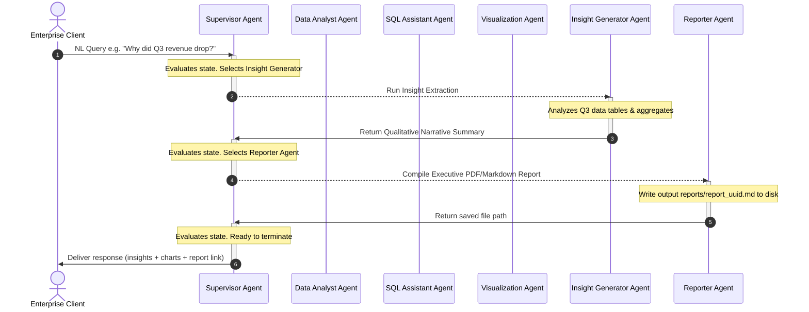
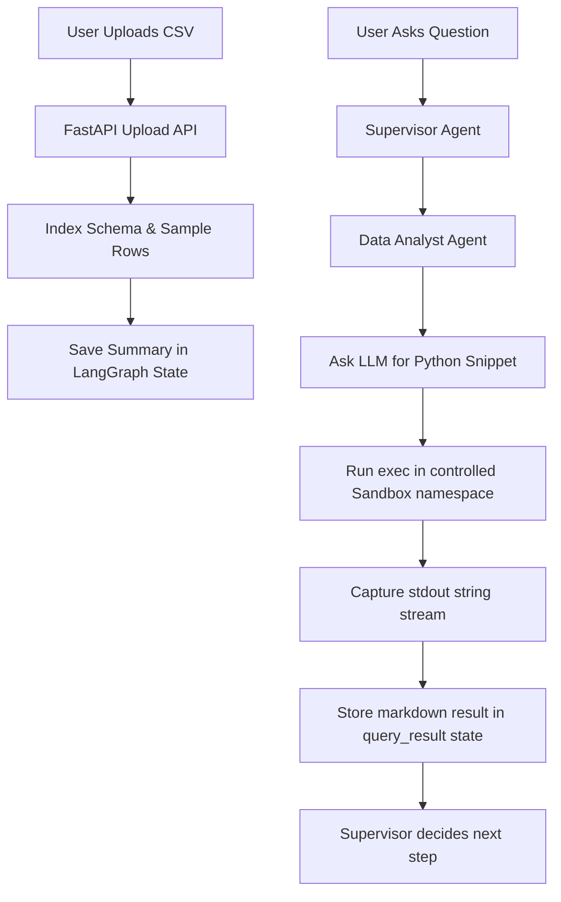

# Enterprise Multi-Agent Analytics Assistant: Architecture Documentation

This document describes the architectural specifications, data flows, and routing workflows of the platform.

---

## 1. System Topology & Deployment Structure

The platform is designed to run in a modular, containerized environment, with microservices communicating over HTTP APIs. If PostgreSQL or Redis are not detected, the backend dynamically falls back to SQLite and local thread-safe In-Memory dictionary blocks.

```mermaid
graph TD
    Client[Browser Streamlit UI] -- HTTP / WebSockets --> Gateway[FastAPI Backend Server]
    
    subgraph Core_Orchestration ["Core Orchestration"]
        Gateway --> Router[LangGraph Agent Graph]
        Router --> AgentBase[Agent Core & LLM Abstraction]
    end
    
    subgraph Data_Memory_Services ["Data & Memory Services"]
        Gateway -- Checkpoints & Session Cache --> RedisCheck[{Redis Cache / Local In-Memory Fallback}]
        Gateway -- Analytical Tables --> PGDB[(PostgreSQL Warehouse / SQLite Fallback)]
    end
    
    subgraph LLM_Services ["LLM Services"]
        AgentBase -- API Invocations --> Gemini[Google Gemini Client]
        AgentBase -- Fallback API --> OpenAI[OpenAI Compatible API]
    end
```

---

## 2. Multi-Agent Workflow Sequence

The LangGraph workflow implements a stateful routing model. The **Supervisor Agent** acts as the central orchestrator, analyzing the user request and intermediate results, then delegating work to specialist agents until a final summary report is compiled.



---

## 3. Data Flow & Sandboxed Code Execution

The **Data Analyst Agent** evaluates local datasets (CSV/Excel) by safely executing generated Pandas statements:


